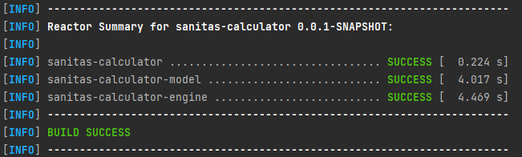
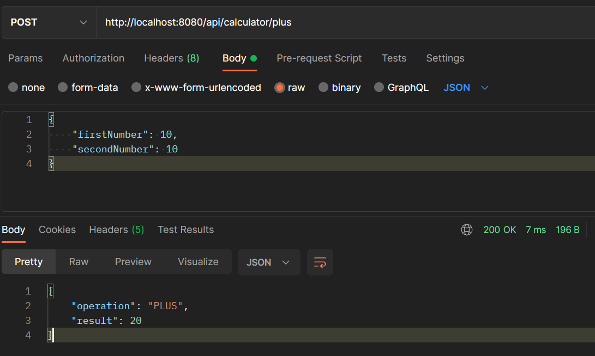

# SANITAS

Project for sanitas where the implementation of a calculator has to be carried out.

## Preconditions

As a first step you need to install Java JDK 11 or 8, Apache Maven 3.3.9 o superior and GIT.

Create a folder in the desired location, as a tip, create in "C:/Calculator".

Create a folder in the desired location, as a tip, create in "C:/Calculator" and by pressing shift key + right mouse
button inside the created folder click to open a command console "Open command windows here".
Type in the console the following command:

* git clone https://github.com/RobelDani/sanitas-calculator.git

After downloading the project

Open the project in IDE (Intellij IDEA preferred) and select the downloaded project "sanitas-calculator".

Run the following command to compile the project.

```bash
mvn clean install
```



## Start project

To execute the API, the following command must be executed in the 'engine' directory within the project:

* mvn spring-boot:run

## Consumption of operations

The first step is to install the Postman application

Both the addition and subtraction operations are designed as POST type.

### PLUS

Sanitas Test Service URL Service: http://[serverIp]:8080/api/calculator/plus
Request

    {
        "firstNumber": 10,
        "secondNumber": 10
    }

Response

    {
        "operation": "PLUS",
        "result": 20
    }



### SUBTRACT

Sanitas Test Service URL Service: http://[serverIp]:8080/api/calculator/subtract
Request

    {
        "firstNumber": 10,
        "secondNumber": 1
    }

Response

    {
        "operation": "SUBTRACT",
        "result": 9
    }


# Autor

Roberto Daniel Blanco Parra
